<!-- TOC START min:1 max:3 link:true update:true -->
- [Git](#git)
  - [对象模型](#)
    - [sha](#sha)
    - [commit](#commit)
    - [tree](#tree)
    - [blob](#blob)
    - [tag](#tag)
    - [引用](#-1)
  - [传输协议](#-2)
    - [哑协议](#-3)
    - [智能协议](#-4)
  - [分支模型](#-5)
    - [例子](#-6)
    - [工作流程](#-7)
    - [分支的变基](#-10)
  - [使用git服务器](#git-1)
    - [架设git服务器](#git-2)
    - [github](#github)
  - [Git 本地操作+基本命令](#git-)
    - [初始化](#-11)
    - [添加](#-12)
    - [提交](#-13)
    - [克隆](#-14)
    - [查看状态](#-15)
    - [查看不同](#-16)
    - [查看提交历史](#-17)
    - [查看远程仓库](#-18)
    - [添加远程仓库](#-19)
    - [从远程仓库抓取数据](#-20)
    - [向远程仓库推送数据](#-21)
    - [列出标签](#-22)
    - [创建标签并显示](#-23)
    - [补充标签](#-24)
    - [推送标签到服务器上](#-25)
    - [创建分支](#-26)
    - [切换分支](#-27)
    - [分支合并](#-28)
    - [分支删除](#-29)
    - [查看信息](#-30)
    - [变基](#-31)

<!-- TOC END -->


# Git
分布式版本控制
版本控制：记录一个或若干文件内容变化
## 对象模型
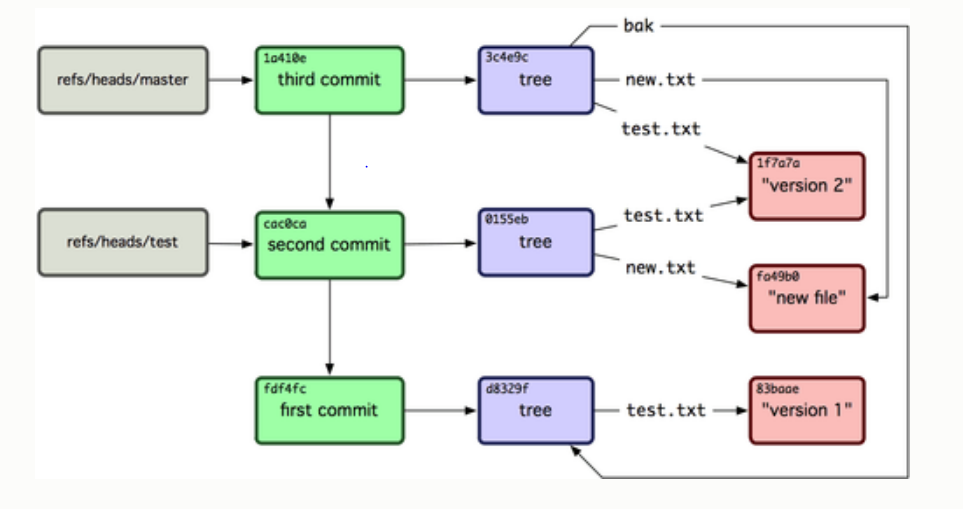
就像在本机的文件系统上构建一个小的文件系统
### sha
Git 使用 SHA-1 算法计算数据的校验和，通过对文件的内容或目录的结构计算出一个 SHA-1 哈希值，作为指纹字符串。该字串由 40 个十六进制字符（0-9 及 a-f）组成，看起来就像是：
```24b9da6552252987aa493b52f8696cd6d3b00373```
Git 的工作完全依赖于这类指纹字串，所以你会经常看到这样的哈希值。实际上，所有保存在 Git 数据库中的东西都是用此哈希值来作索引的，而不是靠文件名。
### commit
指明了该时间点项目快照的顶层树对象、作者/提交者信息（从 Git 设置的 user.name 和 user.email中获得)以及当前时间戳、一个空行，以及提交注释信息
每一个 commit 对象都指向了你创建的树对象快照
指向前继对象

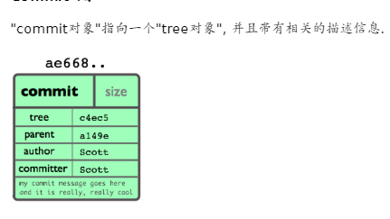
+ 一个tree 对象: tree对象的SHA1签名, 代表着目录在某一时间点的内容.
+ 父对象父对象(parent(s)): 提交(commit)的SHA1签名代表着当前提交前一步的项目历史.
  + 上面的那个例子就只有一个父对象;
  +  合并的提交(merge commits)可能会有不只一个父对象. 如果一个提交没有父对象, 那么我们就叫它“根提交"(root commit), 它就代表着项目最初的一个版本(revision). 每个项目必须有至少有一个“根提交"(root commit).
  +  一个项目可能有多个"根提交“，虽然这并不常见(这不是好的作法).
+ 作者作者: 做了此次修改的人的名字, 还有修改日期.
+ 提交者提交者（committer): 实际创建提交(commit)的人的名字, 同时也带有提交日期. TA可能会和作者不是同一个人; 例如作者写一个补丁(patch)并把它用邮件发给提交者, 由他来创建提交(commit).
### tree
一个单独的 tree 对象包含一条或多条 tree 记录，每一条记录含有一个指向 blob 或子 tree 对象的 SHA-1 指针，并附有该对象的权限模式 (mode)、类型和文件名信息。
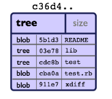
### blob
基本块
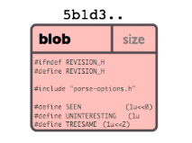
### tag
Tag 对象指向一个 commit 而不是一个 tree。它就像是一个分支引用，但是不会变化——永远指向同一个 commit，仅仅是提供一个更加友好的名字。
### 引用
## 传输协议
### 哑协议
Git 基于HTTP之上传输通常被称为哑协议，这是因为它在服务端不需要有针对 Git 特有的代码。这个获取过程仅仅是一系列GET请求
### 智能协议
使用智能协议是传送数据的更常用的方法。这些协议在远端都有Git智能型进程在服务 － 它可以读出本地数据并计算出客户端所需要的，并生成合适的数据给它，这有两类传输数据的进程：一对用于上传数据和一对用于下载。


## 分支模型

### 例子
单次提交
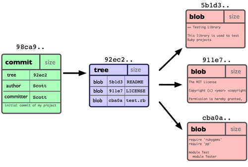
多次提交，一个commit对应一个快照
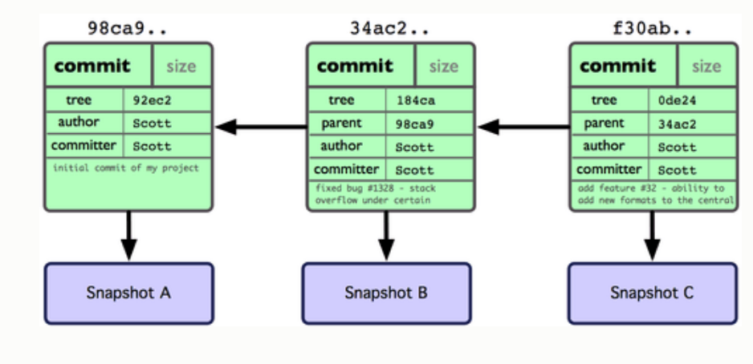
master分支
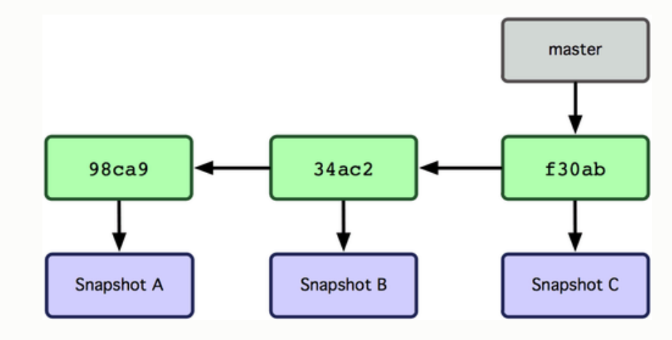
创建分支但未切换Head
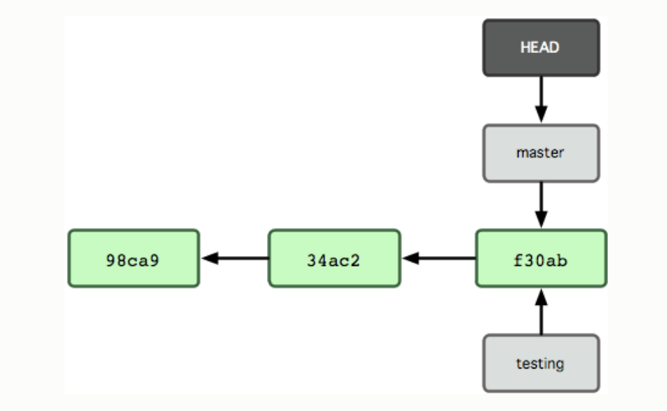
切换分支
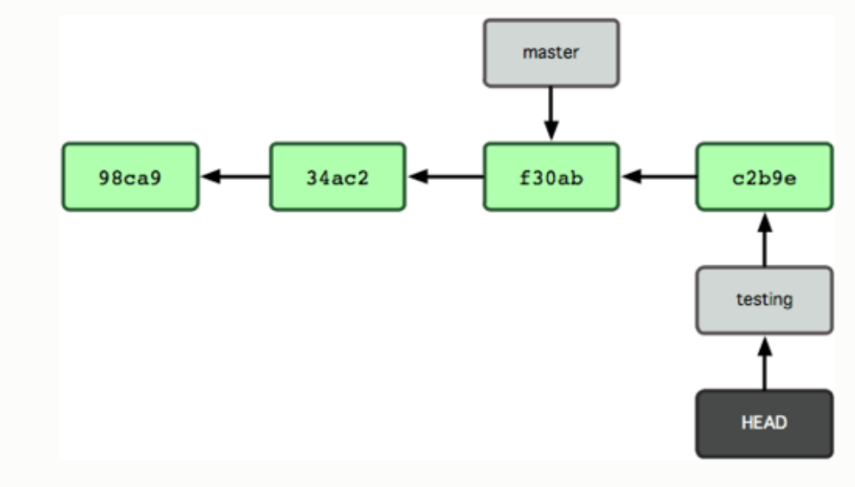
分支 master 和 test
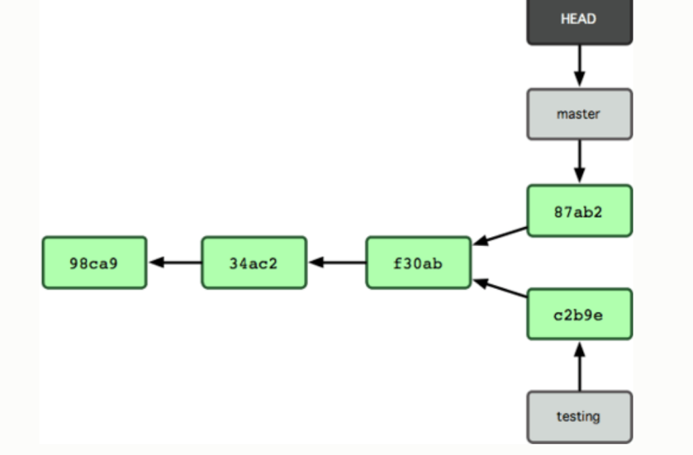
分支合并
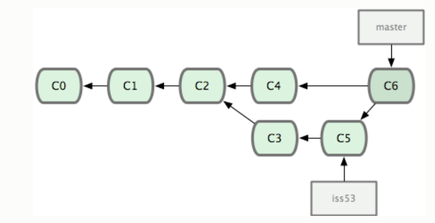

### 工作流程
#### 长期分支
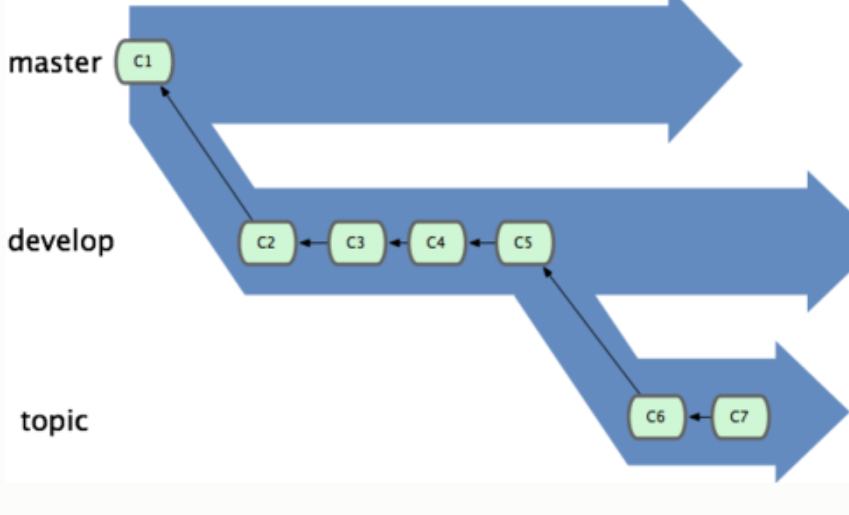
#### 特性分支
这些分支全部都是本地分支，这一点很重要。当你在使用分支及合并的时候，一切都是在你自己的 Git 仓库中进行的 — 完全不涉及与服务器的交互

### 分支的变基
一旦分支中的提交对象发布到公共仓库，就千万不要对该分支进行变基操作

## 使用git服务器
### 架设git服务器
### github

## Git 本地操作+基本命令

### 初始化
```git init```
### 添加
```git add```
### 提交
```git commit -m 'initial project version'```
跳过 add，给 git commit 加上 -a 选项
### 克隆
```git clone git://github.com/schacon/grit.git mygrit```

### 查看状态
```git status```
### 查看不同
```git diff```
```git diff --cached```
### 查看提交历史
```git log```

### 查看远程仓库
```git remote -v```
### 添加远程仓库
```git remote add pb git://github.com/A/B.git```
### 从远程仓库抓取数据
```git fetch [remote-name]```
```git pull 抓取并合并 ```
### 向远程仓库推送数据
```git push origin master```

### 列出标签
```git tag```
```git tag -l 'v1.4.2.*'```
### 创建标签并显示
```  git tag -a v1.4 -m 'my version 1.4'```
```git show v1.4```
### 补充标签
```git tag -a v1.2 9fceb02```
### 推送标签到服务器上
```git push origin --tags```

### 创建分支
```git branch testing```
### 切换分支
```git checkout testing```
### 分支合并
```git checkout master```
```git merge iss53```
### 分支删除
```git branch -d testing```
### 查看信息
git branch -v
git branch --merged
git branch --no-merged

### 变基
git checkout experiment
git rebase master

git rebase --onto master server client
