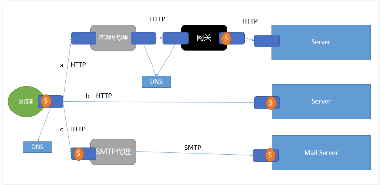

<!-- TOC START min:1 max:3 link:true update:true -->
- [REST原理](#rest)
- [第一章：软件架构框架](#)
- [第三章：](#-1)
- [第四章：基于网络的架构风格](#-2)
- [第五章：REST](#rest-1)
  - [推导](#-3)
  - [架构元素](#-4)
    - [数据元素](#-5)
    - [连接器](#-6)
    - [组件](#-7)
  - [架构视图](#-8)
    - [过程](#-9)
    - [连接器](#-10)
    - [数据](#-11)

<!-- TOC END -->

# REST原理
# 第一章：软件架构框架
# 第三章：
# 第四章：基于网络的架构风格
http://www.cnblogs.com/linianhui/p/rest_network-based-software-architecture-style.html#auto_id_3
# 第五章：REST
http://www.cnblogs.com/linianhui/p/rest_web-and-rest.html
REST架构风格由客户端-服务器、无状态、缓存、统一接口、分层系统和按需代码这6个架构约束构成，同时统一接口这个架构约束由资源的标识、通过表述操作资源、自描述的消息和HATEOAS这4个接口约束构成。其中REST的核心特征在于统一接口，而统一接口的核心在于HATEOAS。
## 推导
+ 分离关注点： 客户端：服务器
+ 无状态： 客户端每个请求必须包含理解该请求所必须的所有信息，服务端处理请求是即刻的
+ 网络效率：缓存

+ 统一接口：REST接口被设计为可高效移交大粒度的超媒体数据
  + 资源识别
  + 通过表述来操作资源
  + 自描述的信息
  + 超媒体作为应用程序状态的引擎（HATEOAS）
+ 分层系统
+ 按需代码
## 架构元素
### 数据元素
原始数据+呈现引擎=镜像
1. 返回镜像：传统cs
2. 数据+引擎：可移动对象（？） 增加数据量
3. 原始数据： 丧失信息隐藏的邮件，发送者和接收者必须理解相同的数据类型。

资源：可被命名的信息
资源标识符：资源的唯一标识。url
表述：表达资源的当前状态或预期状态  数据、表述元数据，资源元数据、控制数据
REST 关注对于数据类型的理解，通过一种数据格式来移交资源的表述。
+ 表述有标准的数据格式的执行。
+ 表述通过一个通用的接口来隐藏信息。

### 连接器
+ 客户：使用
+ 服务器：提供
+ 缓存：
+ 隧道：
+ 解析器

### 组件
来源服务器： Apache，Ngnix，IIS
网关：CGI，反向代理
代理：
用户代理：

## 架构视图
### 过程

### 连接器
REST的连接器视图聚焦于组件之间的通信机制
### 数据
应用的下一个控制状态位于第一个请求的响应的表述之中，从一个表述迁移到下一个表述，因此这样的一系列表述可以构造出一个资源的有限状态机，即超媒体作为应用程序的状态引擎（HATEOAS）。
