# 一、Git相关知识

## 1. Git是什么？
官方简介 from https://git-scm.com/
>Git is a free and open source distributed version control system designed to handle everything from small to very large projects with speed and efficiency.
>Git is easy to learn and has a tiny footprint with lightning fast performance. It outclasses SCM tools like Subversion, CVS, Perforce, and ClearCase with features like cheap local branching, convenient staging areas, and multiple workflows.

Git 是一个免费开源的分布式版本控制系统。相对 SCM 工具,具有低代价构建本地分支，便利的暂存区域，复合工作流等优点。
## 2. Git的对象模型？

Git 有四种对象模型：blob，tree，commit，tag。直观的如下图，红色的为blob，紫色的为tree，绿色的为commit，灰色的为tag。

Git通过对文件的内容或目录的结构计算出一个 SHA-1 哈希值，作为指纹字符串。该字串由 40 个十六进制字符（0-9 及 a-f）组成，看起来就像是：```24b9da6552252987aa493b52f8696cd6d3b00373```。Git 使用哈希值作索引，而非靠文件名。
### A. blob
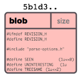
基本的存储单元
### B. tree
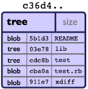
一个单独的 tree 对象包含一条或多条 tree 记录，每一条记录含有一个指向 blob 或子 tree 对象的 SHA-1 指针，并附有该对象的权限模式 (mode)、类型和文件名信息。

### C. commit

commit对象指向一个tree对象，并带有相关的描述信息。指明了该时间点项目快照的顶层树对象、作者/提交者信息，以及当前时间戳、一个空行，以及提交注释信息，以及前继对象。
+ tree 对象: tree对象的SHA1签名, 代表着目录在某一时间点的内容.
+ 父对象(parent(s)): 提交(commit)的SHA1签名代表着当前提交前一步的项目历史.
  +  合并的提交(merge commits)可能会有不只一个父对象. 如果一个提交没有父对象, 那么我们就叫它“根提交"(root commit), 它就代表着项目最初的一个版本(revision). 每个项目必须有至少有一个“根提交"(root commit).
+ 作者（author）: 做了此次修改的人的名字, 还有修改日期.
+ 提交者（committer): 实际创建提交(commit)的人的名字, 同时也带有提交日期. 提交者可能会和作者不是同一个人; 例如作者写一个补丁(patch)并把它用邮件发给提交者, 由他来创建提交(commit).
### D. tag
Tag 对象指向一个 commit 而不是一个 tree。它就像是一个分支引用，但是不会变化——永远指向同一个 commit，仅仅是提供一个更加友好的名字。
## 3. Git分支模型
### A. 单次提交

### B. 多次提交
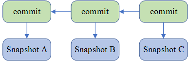
### C. master和develop分支

### D. master和issue分支 合并

# 二、Github 相关API
Github 提供了REST API 供使用者获取各种各样的信息。API 网址：https://developer.github.com/v3/ 。
## 1. 使用的的部分API：
+ 获取issues：
  + GET /repos/:owner/:repo/issues
+ 获取单个 issue:
  + GET /repos/:owner/:repo/issues/:number
+ 获取commits:
  + GET /repos/:owner/:repo/commits
+ 获取单个commit：
  + 相比获取commits，能得到该commit具体的filechanges
  + GET /repos/:owner/:repo/commits/:sha
+ 获取pull-requests：
  + /repos/:owner/:repo/pulls
+ 获取events：
  + GET /repos/:owner/:repo/events
+ 获取comments：
  + GET /repos/:owner/:repo/comments
+ 搜索项目：
  + GET /search/repositories
    + q：The search keywords, as well as any qualifiers.
    + sort：The sort field. One of stars, forks, or updated. Default: results are sorted by best match.
    + order：The sort order if sort parameter is provided. One of asc or desc. Default: desc
+ 获得文件数据
  + 获取一个commit：GET /repos/:owner/:repo/git/commits/:sha
  + 获得一个tree：/repos/:owner/:repo/git/trees/:sha
  + 获得一个blob：GET /repos/:owner/:repo/git/blobs/:sha
## 2. 可以获得哪些信息
+ 使用 issues、commits、pull-requests、comments、events API，可以获取到具体 仓库（user/repo）的issue，commit和pull-request信息。
+ 使用搜索项目 API，可以获得符合要求的项目列表
+ 使用获取文件数据，可以获得Github上具体的Git数据

### A. issue
#### 基本
```json
{
    "id": 305537440,
    "number": 2151,
    "title": "Release 2.7.0 beta v1",
    "body": "Implements #2147 ",
    "labels": [],
    "state": "open",
    "locked": false,
    "user": {},
    "assignee": {},
    "assignees": [{}],
    "milestone": null,
    "comments": 1,
    "created_at": "",
    "updated_at": "",
    "closed_at": null,
    "author_association": "CONTRIBUTOR",
}
```
#### url
```json
{
    "url": "",
    "repository_url": "",
    "labels_url":"",
    "comments_url": "",
    "events_url": "",
    "html_url": "",
}
```
#### pull-request
如果该issue 是 pull-request的信息，则包含 pull-request链接
```json
{
  "pull_request": {
      "url": "",
      "html_url": "",
      "diff_url": "",
      "patch_url": "",
      }
}
```
### B. commit
#### 基本
```json
{
    "sha": "ecf9dd20227152cbc6db915800694b1a215e95dc",
    "commit": {
      "author": {},
      "committer": {},
      "message": "Merge pull request #2142 from sd1998/Fix-2141\n\nFix to Issue #2141",
      "tree": { },
      "url": "",
      "comment_count": 0,
      "verification": { }
    },

    "author": { },
    "committer": {},
    "parents": [{ }]
  }
```
#### url
```json
{
  "url": "",
  "html_url": "",
  "comments_url": "",
}
```
#### 逐个获取commit 可得到filechanges信息
```json
"stats": {
    "total": 86,
    "additions": 43,
    "deletions": 43
  },
  "files": [
    {
      "sha": "581b0aaee29474f678aec91a3cb4771d9e7eb88b",
      "filename": "src/com/owncloud/android/ui/activity/UploadFilesActivity.java",
      "status": "modified",
      "additions": 43,
      "deletions": 43,
      "changes": 86,
      "blob_url": "blob url",
      "raw_url": "原始文件",
      "contents_url": "",
      "patch": "修改内容"
    }
  ]
```
### C. pull-requesrt
#### 基本
```json
{
    "id": 175267245,
    "number": 2152,
    "state": "open",
    "locked": false,
    "title": "fix download/available offline icons",
    "body": "fixes issues 2145",
    "created_at": "2018-03-15T14:26:32Z",
    "updated_at": "2018-03-15T14:30:30Z",
    "closed_at": null,
    "merged_at": null,
    "merge_commit_sha": "89afd53c96a5cbf9f0d6f473dda305c2c3f407fd",

    "user": {},
    "assignee": null,
    "assignees": [],
    "requested_reviewers": [{}],
    "requested_teams": [],
    "labels": [],
    "milestone": null,
    "author_association": "NONE",

    "head": {
      "label": "owncloud:downicon",
      "ref": "downicon",
      "sha": "a2b2adbaa8b581606388bc35282ef7b3b373f914",
      "user": {},
      "repo": {}
    },
    "base": {
      "label": "owncloud:master",
      "ref": "master",
      "sha": "cbc34f7d097f447a1bc60464c98e371762b62b1d",
      "user": {      },
      "repo": {"仓库信息" }
    },

},
```
#### URL
```json
{
    "url": "",
    "html_url": "",
    "diff_url": "",
    "patch_url": "",
    "issue_url": "",
    "commits_url": "",
    "review_comments_url": "",
    "review_comment_url": "",
    "comments_url": "",
    "statuses_url": "",
    "_links": {"各种link_url"},
}
```
### D. events
#### 获得issue下的events
events_url:""
```json
{
    "id": 1536688161,
    "url": "https://api.github.com/repos/owncloud/android/issues/events/1536688161",
    "actor": {},
    "event": "mentioned",
    "commit_id": null,
    "commit_url": null,
    "created_at": "2018-03-22T21:52:08Z"
}
```

### E. comments
#### 获得issue下的comments
```json
{
    "url": "",
    "html_url": "",
    "issue_url": "",
    "id": 375349930,
    "user": {},
    "created_at": "2018-03-22T15:33:31Z",
    "updated_at": "2018-03-22T15:33:31Z",
    "author_association": "CONTRIBUTOR",
    "body": "@davigonz I think this would be a nice feature."
}
```
### F. 获得仓库repo
#### 基本信息
```json
{
  "total_count": 647,
  "incomplete_results": false,
  "items": [{}]
}
```
#### items中的信息
```json
{
    "id": 3250434,
    "name": "dozer",
    "full_name": "DozerMapper/dozer",
    "owner": {},
    "private": false,
    "description": "Dozer is a Java Bean to Java Bean mapper that recursively copies data from one object to another. ",

    "created_at": "2012-01-23T21:11:58Z",
    "updated_at": "2018-03-19T08:00:20Z",
    "pushed_at": "2018-03-18T19:47:45Z",

    "size": 19059,
    "stargazers_count": 1050,
    "watchers_count": 1050,
    "open_issues_count": 83,
    "license": {      },
    "forks": 348,
    "forks_count": 348,
    "open_issues": 83,
    "watchers": 1050,
    "default_branch": "master",
    "score": 1.0
    "language": "Java",
    "has_issues": true,
    "has_projects": true,
    "has_downloads": true,
    "has_wiki": true,
    "has_pages": false,
    "mirror_url": null,
    "archived": false,
    "fork": false,
}
```
#### items中的url
```json
{
    "url": "https://api.github.com/repos/DozerMapper/dozer",
    "html_url": "https://github.com/DozerMapper/dozer",
    "forks_url": "https://api.github.com/repos/DozerMapper/dozer/forks",
    "keys_url": "https://api.github.com/repos/DozerMapper/dozer/keys{/key_id}",
    "collaborators_url": "https://api.github.com/repos/DozerMapper/dozer/collaborators{/collaborator}",
    "teams_url": "https://api.github.com/repos/DozerMapper/dozer/teams",
    "hooks_url": "https://api.github.com/repos/DozerMapper/dozer/hooks",
    "issue_events_url": "https://api.github.com/repos/DozerMapper/dozer/issues/events{/number}",
    "events_url": "https://api.github.com/repos/DozerMapper/dozer/events",
    "assignees_url": "https://api.github.com/repos/DozerMapper/dozer/assignees{/user}",
    "branches_url": "https://api.github.com/repos/DozerMapper/dozer/branches{/branch}",
    "tags_url": "https://api.github.com/repos/DozerMapper/dozer/tags",
    "blobs_url": "https://api.github.com/repos/DozerMapper/dozer/git/blobs{/sha}",
    "git_tags_url": "https://api.github.com/repos/DozerMapper/dozer/git/tags{/sha}",
    "git_refs_url": "https://api.github.com/repos/DozerMapper/dozer/git/refs{/sha}",
    "trees_url": "https://api.github.com/repos/DozerMapper/dozer/git/trees{/sha}",
    "statuses_url": "https://api.github.com/repos/DozerMapper/dozer/statuses/{sha}",
    "languages_url": "https://api.github.com/repos/DozerMapper/dozer/languages",
    "stargazers_url": "https://api.github.com/repos/DozerMapper/dozer/stargazers",
    "contributors_url": "https://api.github.com/repos/DozerMapper/dozer/contributors",
    "subscribers_url": "https://api.github.com/repos/DozerMapper/dozer/subscribers",
    "subscription_url": "https://api.github.com/repos/DozerMapper/dozer/subscription",
    "commits_url": "https://api.github.com/repos/DozerMapper/dozer/commits{/sha}",
    "git_commits_url": "https://api.github.com/repos/DozerMapper/dozer/git/commits{/sha}",
    "comments_url": "https://api.github.com/repos/DozerMapper/dozer/comments{/number}",
    "issue_comment_url": "https://api.github.com/repos/DozerMapper/dozer/issues/comments{/number}",
    "contents_url": "https://api.github.com/repos/DozerMapper/dozer/contents/{+path}",
    "compare_url": "https://api.github.com/repos/DozerMapper/dozer/compare/{base}...{head}",
    "merges_url": "https://api.github.com/repos/DozerMapper/dozer/merges",
    "archive_url": "https://api.github.com/repos/DozerMapper/dozer/{archive_format}{/ref}",
    "downloads_url": "https://api.github.com/repos/DozerMapper/dozer/downloads",
    "issues_url": "https://api.github.com/repos/DozerMapper/dozer/issues{/number}",
    "pulls_url": "https://api.github.com/repos/DozerMapper/dozer/pulls{/number}",
    "milestones_url": "https://api.github.com/repos/DozerMapper/dozer/milestones{/number}",
    "notifications_url": "https://api.github.com/repos/DozerMapper/dozer/notifications{?since,all,participating}",
    "labels_url": "https://api.github.com/repos/DozerMapper/dozer/labels{/name}",
    "releases_url": "https://api.github.com/repos/DozerMapper/dozer/releases{/id}",
    "deployments_url": "https://api.github.com/repos/DozerMapper/dozer/deployments",
    "git_url": "git://github.com/DozerMapper/dozer.git",
    "ssh_url": "git@github.com:DozerMapper/dozer.git",
    "clone_url": "https://github.com/DozerMapper/dozer.git",
    "svn_url": "https://github.com/DozerMapper/dozer",
    "homepage": "https://dozermapper.github.io/",
}
```

## 3. 获取到的信息关联如图所示：
### A. 获取合适的Android项目：
#### API 筛选
主题为Android，语言为Java，按星数排序
Get https://api.github.com/search/repositories?q=topic:Android+language:Java&sort=stars&order=desc
显示项目20000+，但分页获取到大概900个项目
#### 确定为Android项目
有些项目是Android相关的项目，但并不是Android项目。
根据git tree 相关API 判断，该项目是否为Android 项目。
+ 包含  "src/main/AndroidManifest.xml" 文件
+ 包含  "src/main/res/layout" 布局相关文件
### B. 获取与bug修复有关的信息
与代码修复相关的信息在commit中的filechanges中。使用两种策略锁定需要的commit。
+ pull-request中的commit。该pull-request的issue标签中包含 “bug”标签。


+ 在commit的附加信息中，包含“bug”，"fix","修复"字样。此类commit找不到对应的issue
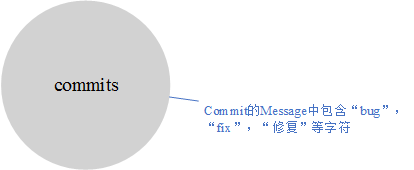

## 3.  最终存储的信息
数据存储
### A.日志文件
data/$(user)_$(repo)/log
### B.爬取数据
对每一个Github上的Android项目，对应MongoDB一个数据库。每个数据库包含的集合对应下面七个集合的一个非空子集：
五种从API获取到的数据
+ events
+ issues
+ comments
+ pulls
+ commits
余下两种是分析前五种集合中的数据后，进一步获取的详细信息，分别对应可能包含bug的两种类型的commit
+ filechanges
+ issue_pull_commit
### C.元数据模型

## 4. 统计信息
### A. 两种类型的commit 占比
+ 包含两种类型的Android项目所占的比例：pulls：filechanges：alls = 71：818： 897
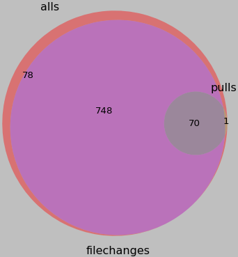

### B. pulls 类型的commit 统计信息
pulls ：
|||
| ------| ------|
包含pull的项目个数| 71
项目中总pulls数量|390
平均每个项目中包含pull数量|5.492957746
pull 最大值和最小值| （68， 1）
](assets/markdown-img-paste-20180323214336525.png)
个数分布：
count| number
| ------| ------ |
1|	30
2|	13
3|	8
4|	4
5|	3
6|	1
7|	1
9|	2
10|	1
14|	2
16|	1
22|	1
31|	1
33|	1
40|	1
68|	1
总计|	71


### B. filechanges 类型的commit 统计信息
|||
| ------| ------|
包含filechanges的项目个数| 818
项目中总filechanges数量|67158
平均每个项目中包含filechanges数量|82
filechanges 最大值和最小值| （5822， 1）
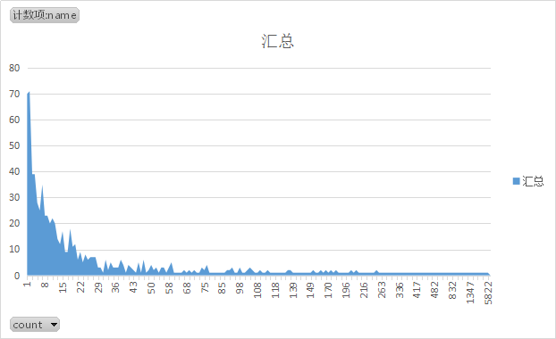
# 方法概述
## 信息获取
### 主要模块及功能
主要包括根据预设条件，从Github上获取合适的Android项目，并依次获得这些项目的具体信息，存储到本地mongodb中。
+ GithubRepo.py：一个Android项目对应一个GithubRepo, 包含Android项目必要的信息。供 CrawlGithub.py 和 DealMongo.py 使用
+ CrawlGithub.py ：根据Android的标识（user，repo），获取 所有Android项目的基本信息，和 Message 属性中包含bug等字样的commit的详细文件改变信息，存储到本地MongoDB相应数据库issues，comments，events，commits，pulls，filechanges 集合中，并生成日志文件记录过程。
+ DealMongo.py ，获取 Android项目的 Label属性中包含bug等字样的pull-request及其相关的详细信息，存储到本地MongoDB相应数据库issue_pull_commit集合中，并生成日志文件记录过程。
+ FindAndroidRepos.py ：获取符合预设条件的Android项目, 生成AndroidRepos.csv 文件。
+ ZGetAllAndroidRepos.py : 根据AndroidRepos.csv文件，依次调用 CrawlGithub.py，并生成日志文件记录过程。
+ ZGetPullsForAllRepos.py：根据AndroidRepo.csv 文件，依次调用 DealMongos.py，并生成日志文件记录过程
+ GetReults：访问mongodb，获得爬取信息的部分统计结果。
### 结构图

### 实现详解

## commit信息统计
commit 修改的文件类型统计
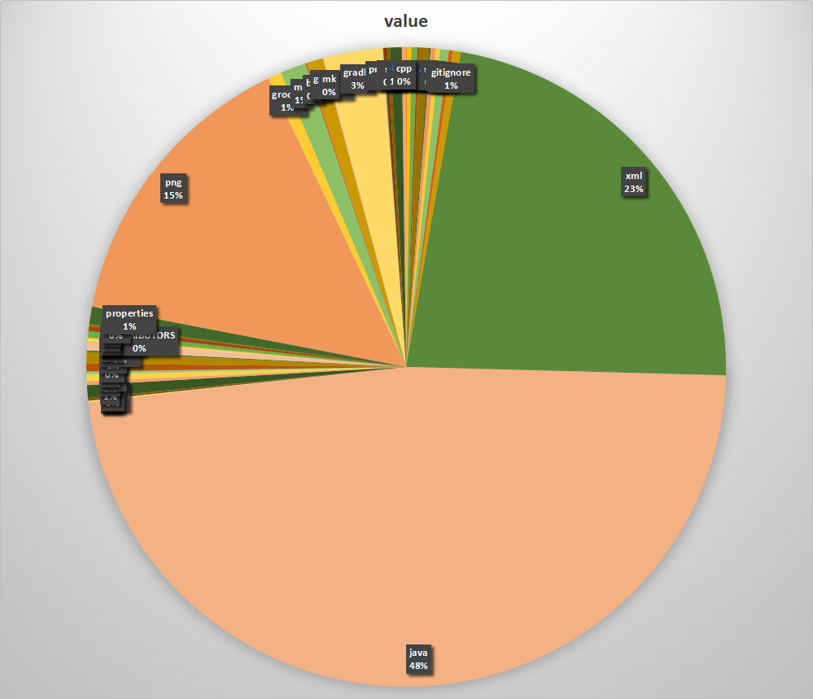
如果考虑具体项目的包含文件类型的文件数量
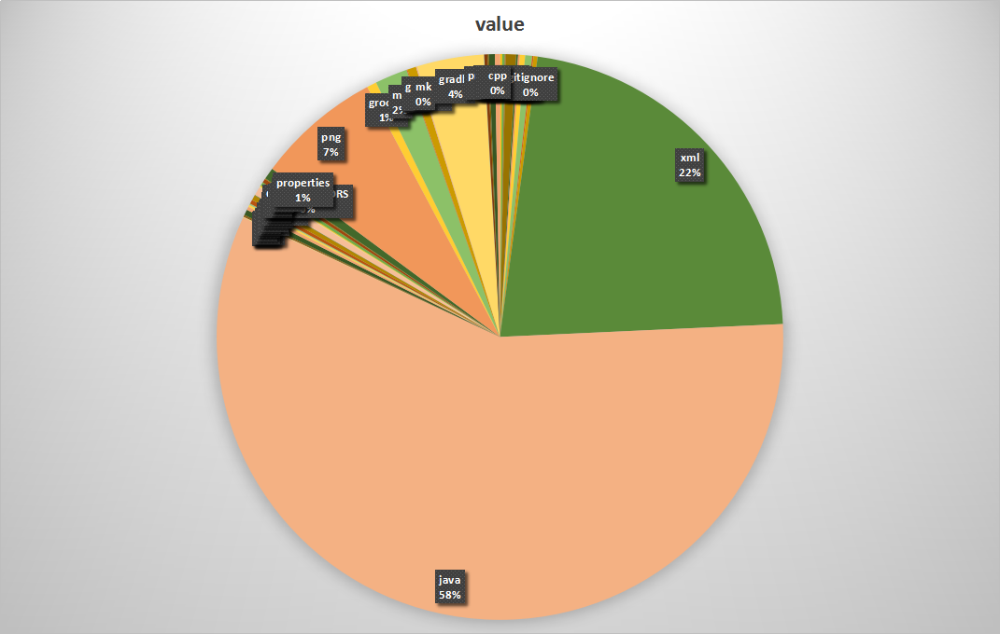
每个commit修改的文件个数

修改数量百分比

java_1

java_2
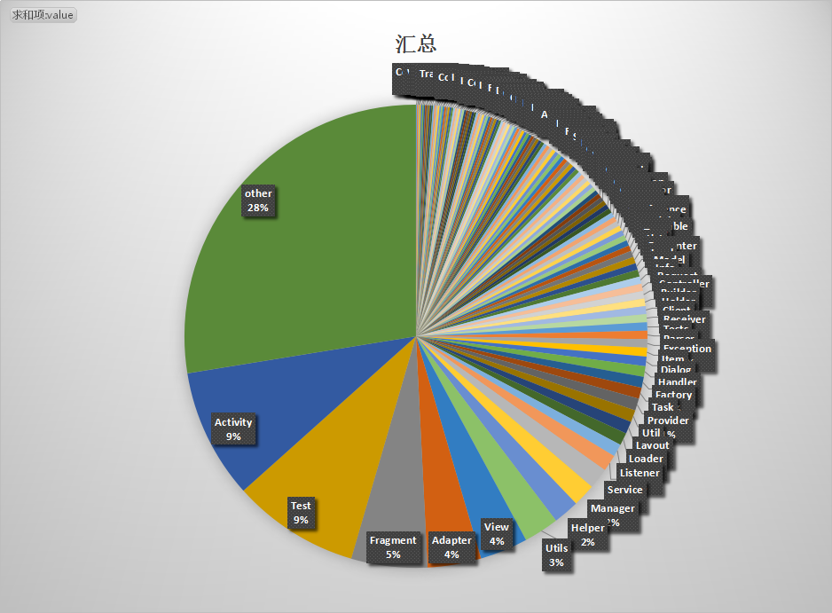
xml_1
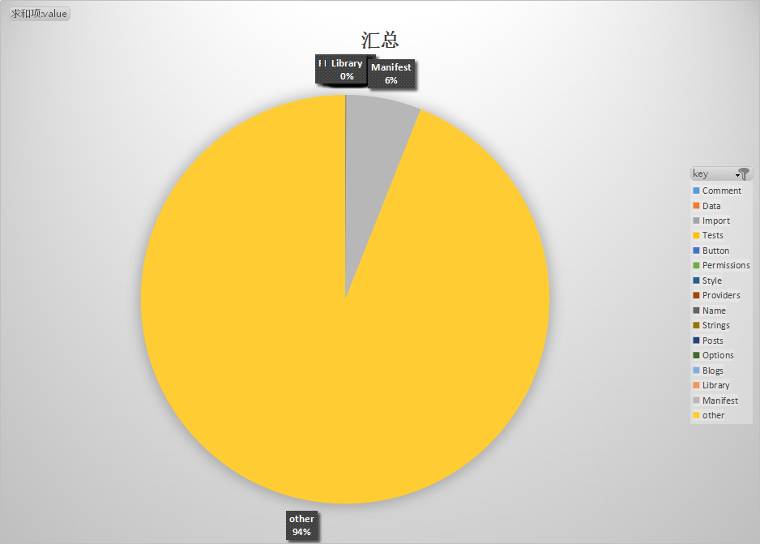
xml_2
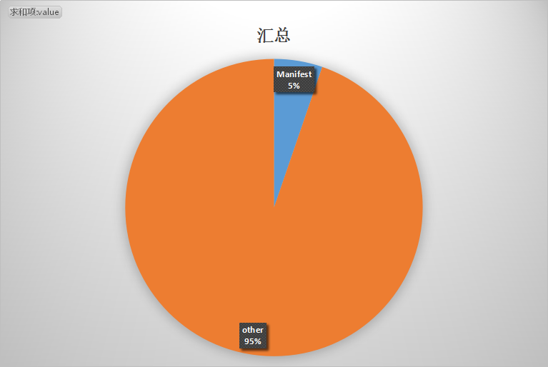
